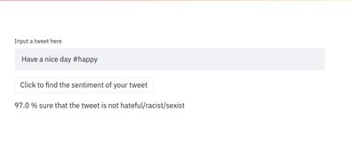

# HateTweetDetector
This model predicts if a tweet is hateful/racist/sexist or not. A Naive classifier, a random forest based classifier and a LR model were trained. The inference in streamlit is based on the best model of the three (LR)

# Dataset
https://www.kaggle.com/arkhoshghalb/twitter-sentiment-analysis-hatred-speech

# Inference
To run the app in streamlit 
``` streamlit run App.py```

